# PO3 Research — ES/NQ Futures Path Results

Research toolkit for measuring ES and NQ futures path structure from 1-minute OHLCV data. The README is results-first: charts and numbers below summarize the current local ES/NQ sample. Methods, conventions, and module details are collapsed below.

This is research infrastructure, not a trading system. “Predictive” means conditional association vs baseline in the sample, not a standalone trade rule.

> **Results below are stale — regeneration pending.** The tracked charts and tables in
> `output/examples/` were generated on 2026-05-11. Since then the local parquet gained
> about two months of data, and the methodology was corrected in several places that
> move these numbers:
>
> | Change | Effect on the tables below |
> | --- | --- |
> | Weekday now rolls at 18:00 ET instead of the calendar day | Weekly-extreme weekday shares change; Monday no longer carries two overnight sessions |
> | Weekly targets restricted to Monday/Tuesday rows | The TWAP/VWAP residual-edge table was computed by pooling all weekdays, including Friday rows where the weekly label is contemporaneous |
> | "Next session" no longer means "day close" | Any next-session figure predates the fix |
> | `Day bullish` dropped for `Globex_Open` as tautological | That level's day-direction row disappears from the matrix |
>
> Re-run the command in [Reproduce These Results](#reproduce-these-results) for current
> numbers. The method descriptions further down describe the *current* code.

## Key Findings From Current ES/NQ Sample

### Weekly extremes skew toward Monday lows and Friday highs

| Symbol | Sample | Most common weekly low | Most common weekly high | Bullish week rate |
| --- | ---: | --- | --- | ---: |
| ES | All | Monday — 35.92% | Friday — 36.53% | 59.59% |
| ES | OOS | Monday — 43.10% | Friday — 40.52% | 59.48% |
| NQ | All | Monday — 36.89% | Friday — 34.83% | 58.62% |
| NQ | OOS | Monday — 40.52% | Friday — 35.34% | 57.76% |

Takeaway: both indices show the same broad path tendency in this sample: weekly lows form most often on Monday, weekly highs most often on Friday, with the pattern stronger in OOS.


### Globex→Midnight direction is early state, not post-midnight prediction

Positive Globex→Midnight change is a strong classifier for the full-day bullish label, but it does not meaningfully predict continuation after midnight.

| Symbol | Split | Full-day bullish baseline | If Midnight > Globex | If Midnight ≤ Globex | Midnight→Close positive baseline | If Midnight > Globex | If Midnight ≤ Globex |
| --- | --- | ---: | ---: | ---: | ---: | ---: | ---: |
| ES | Train | 54.63% | 63.56% | 45.20% | 54.63% | 53.82% | 55.48% |
| ES | OOS | 55.41% | 62.76% | 47.06% | 52.29% | 50.69% | 54.12% |
| NQ | Train | 55.11% | 63.57% | 45.57% | 55.18% | 55.47% | 54.84% |
| NQ | OOS | 54.41% | 63.61% | 43.60% | 53.86% | 53.74% | 54.00% |

Takeaway: “Midnight above Globex” mostly says the day is already bullish relative to the Globex open. It is useful as an early day-state label, but the forward-only Midnight→Close test shows little/no continuation edge.

Note: the ES Train row repeats 54.63% in both baseline columns. Those are separate
quantities and recomputation puts them about a point apart, so that cell is a
transcription error. This table is now generated into `readme_findings_summary.csv`,
so the next regeneration will replace it.

### Midnight-open retaps remain common after the cash open

| Symbol | Train condition | Probability midnight open is touched later |
| --- | --- | ---: |
| ES | From 09:30 ET through same-day close | 65.72% |
| ES | From 13:00 ET through same-day close | 38.53% |
| NQ | From 09:30 ET through same-day close | 69.67% |
| NQ | From 13:00 ET through same-day close | 36.60% |

Takeaway: a large share of days still retap the NY midnight open after 09:30 ET. By 13:00 ET, retap probability drops but remains material.

### TWAP/VWAP needed a sanity check: same-level close state was mostly tautological

The first pass showed large deltas for “TWAP/VWAP above a key open → day closes above that same key open.” That is mostly a mechanical state check: if price spent the window above a level, closing above that level later is not much of a discovery.

The current matrix removes that headline target and scores only future/non-overlap outcomes. It also subtracts a simple sanity baseline: whether the window ended above or below the same level. Positive values below are the residual edge after that baseline.

| Symbol | Strongest OOS non-tautological level/window | Signal | Target | Best side | Residual edge |
| --- | --- | --- | --- | --- | ---: |
| ES | NY 13:00 Open / 13:00→Close | VWAP | Weekly high Friday | Below | 2.95 ppt |
| ES | Globex Open / Globex→Midnight | VWAP | Week bullish | Below | 2.74 ppt |
| ES | Globex Open / Globex→Midnight | VWAP | Weekly low Monday | Below | 2.33 ppt |
| NQ | NY 09:30 Open / 09:30→13:00 | TWAP | Week bullish | Below | 3.72 ppt |
| NQ | Globex Open / Globex→Midnight | TWAP | Week bullish | Below | 2.91 ppt |
| NQ | Globex Open / Globex→Midnight | VWAP | Week bullish | Below | 2.83 ppt |

Interpretation: once the obvious “where did the window close vs the level?” baseline is removed, remaining TWAP/VWAP edge is much smaller. Treat these as weak conditional structure candidates, not strong predictive findings.

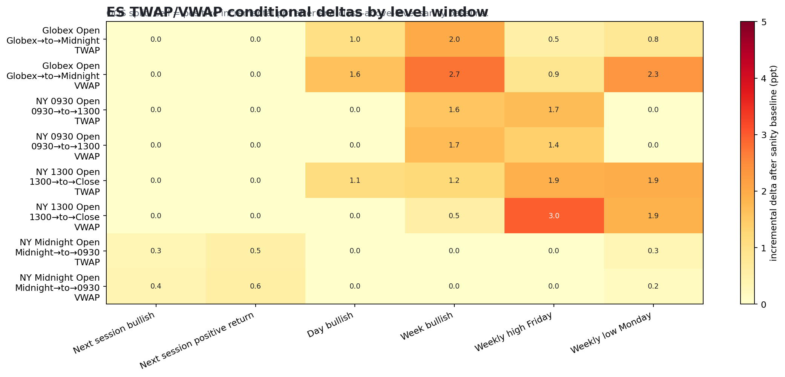

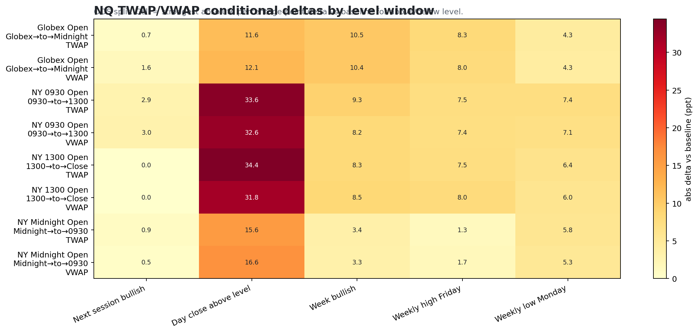

### Monthly path structure is a drift artifact on both symbols

> The three findings below were generated on 2026-08-10 from the current parquet and
> are **not** subject to the staleness warning above, which applies to the tracked
> `output/examples/` gallery. Reproduce with the monthly and week modules.

Monthly extreme timing looks strong against a uniform baseline and disappears against
a fair one. ES, 192 complete months, observed High-Late **54.2%**:

| Null | ES High-Late | p | NQ High-Late | p |
| --- | ---: | ---: | ---: | ---: |
| uniform — not produced, and wrong | 33.3 | — | 33.3 | — |
| `arcsine` — randomness alone | 39.2 | — | 39.2 | — |
| `driftless` | 38.2 | 0.000 | 38.2 | 0.000 |
| `drift` | 44.7 | 0.004 | 46.0 | 0.046 |
| `drift_vol` | 47.3 | 0.064 | 48.4 | 0.236 |
| `shuffle` | 52.5 | 0.586 | 52.4 | 0.832 |

Across all 30 bucket cells the minimum p under `shuffle` is 0.098 (ES) and 0.108 (NQ) —
nothing significant on either symbol, before any multiple-comparisons correction.

Level touch rates go the same way. `Prior_Month_High` is touched in 69.3% of months
against `Prior_Month_Low`'s 30.7% (ES) and 69.3% / 34.4% (NQ) — an asymmetry produced
by drift and volatility, not by the levels. Every rung reproduces the high-touch rate;
the low-touch rate is significant against `driftless` (p=0.002) and `drift` (p=0.046)
and explained once each month's own volatility is priced in (`drift_vol` p=0.212).

One cell survives the strictest rung, pointing away from a "levels attract price"
reading: ES touches its prior-month high **less** than its own returns reshuffled
(69.3% vs 76.5%, p=0.000). That is 1 significant cell of 16 and carries the same
multiple-comparisons caveat as every other grid here.

### Month-state does not condition daily direction

Every knowable month-state conditioner sits within ~2 ppt of base rate on both
symbols (`Third_In_Month` 54.0–56.1 against a 55% base). Train→OOS sign agreement is
0.49–0.70 across the intraday grid, and weekly `Week_Bullish` correlates −0.07 on ES
and +0.20 on NQ — the two symbols do not agree on the sign.

The two conditioners that appear to work do not. `Month_Return_So_Far_Pct` runs to the
current session's close and produces a ~29 ppt spread against a same-session target;
its fully lagged twin `Month_Return_To_Prior_Close_Pct` produces 2–3 ppt. The spread
is the session's own return read back. `Above_Monthly_Open` has the same defect and
the same magnitude (~28 ppt) and no lagged twin.

### Intraday range magnitude is conditioned by the sign of the prior path, not its size

Scored as `Window_Log_Range_Ratio` — today's window range over the prior session's
same window — so volatility clustering is already in the denominator.

| ES `1300_to_Close`, Train | log ratio | as a factor |
| --- | ---: | ---: |
| P25 Low — down morning | +0.186 | **1.20×** yesterday's afternoon |
| P75 High — up morning | −0.177 | **0.84×** yesterday's afternoon |
| spread | −0.363 | **0.70×** between buckets |

An up morning is followed by an afternoon ~30% narrower than a down morning's,
measured against each day's own baseline. It replicates: ES Train −0.363 / OOS −0.591,
NQ Train −0.344 / OOS −0.567, CIs disjoint in all four. `Prior_Window_Return_Pct`
tells the same story (ES −0.302 / −0.397, NQ −0.312 / −0.412).

Conditioning range on **range** is mostly the vol clustering the ratio already removes:
raw range spreads of 0.75–1.03 ppt collapse to a 1.10–1.23× residual on the morning
window (significant on both symbols) and to nothing on the afternoon (0.98–1.06,
overlapping CIs). The size of the prior move carries little; its sign carries most.

## ES/NQ Result Gallery

| ES | NQ |
| --- | --- |
| 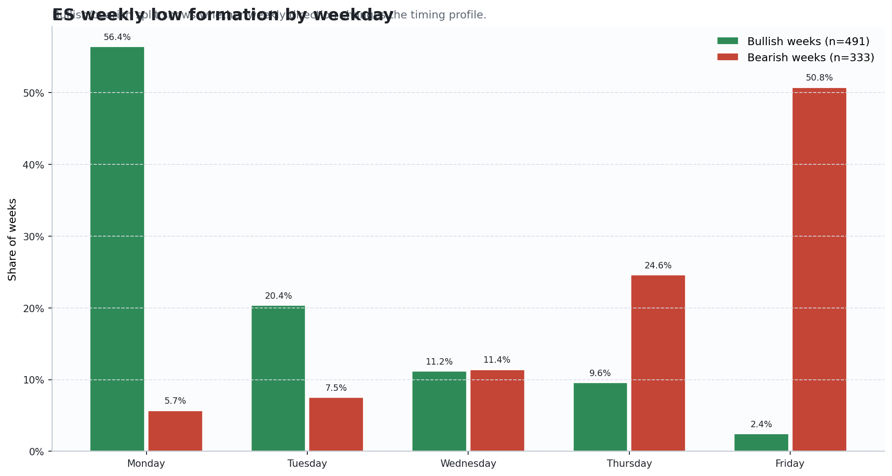 | 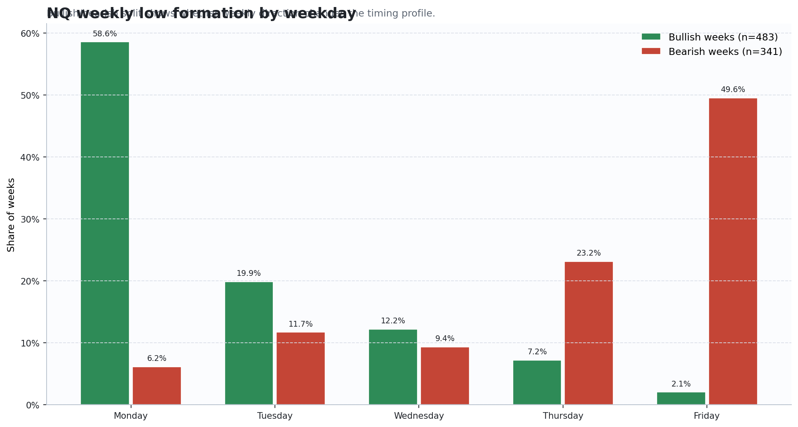 |
| 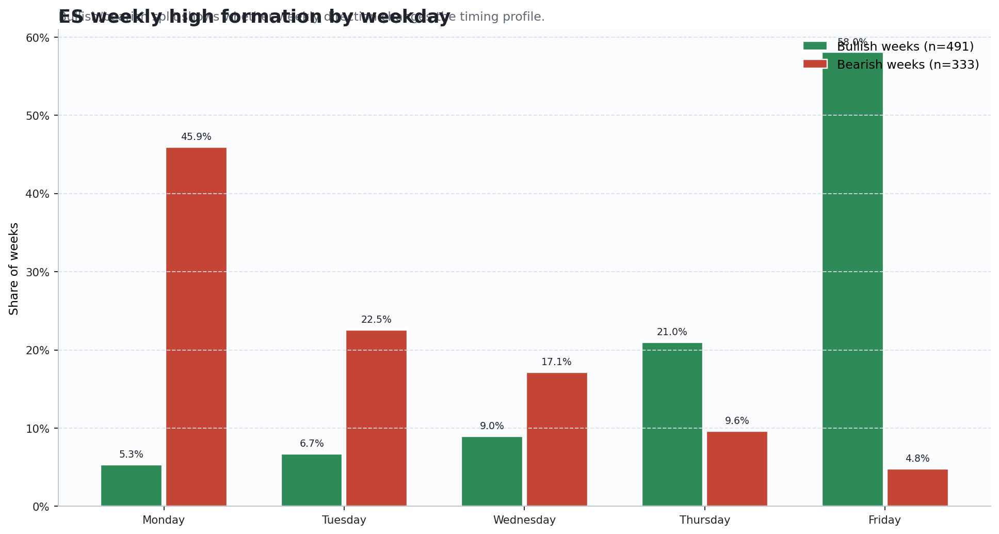 | 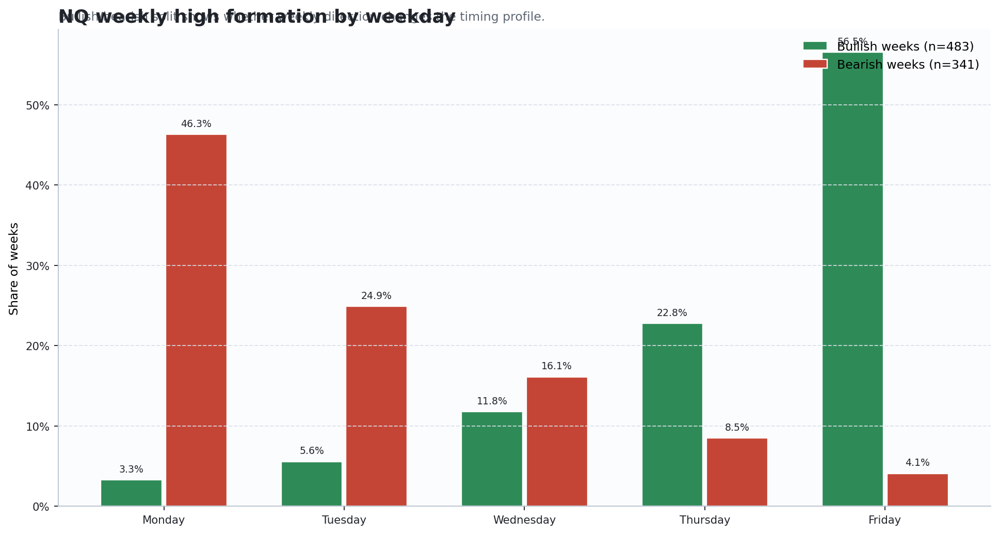 |
| 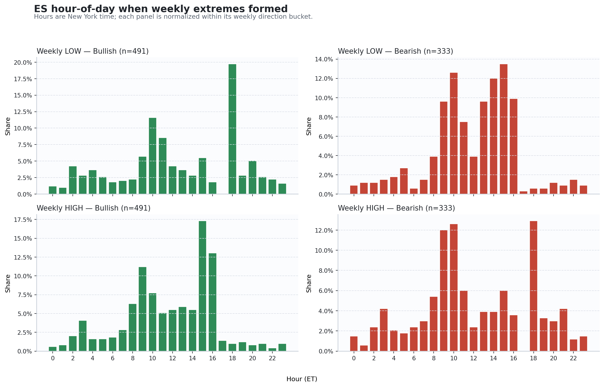 | 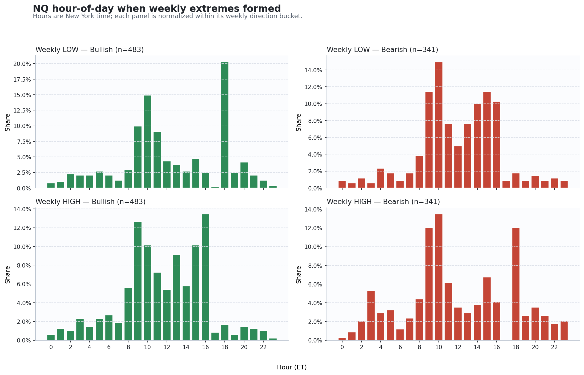 |
| 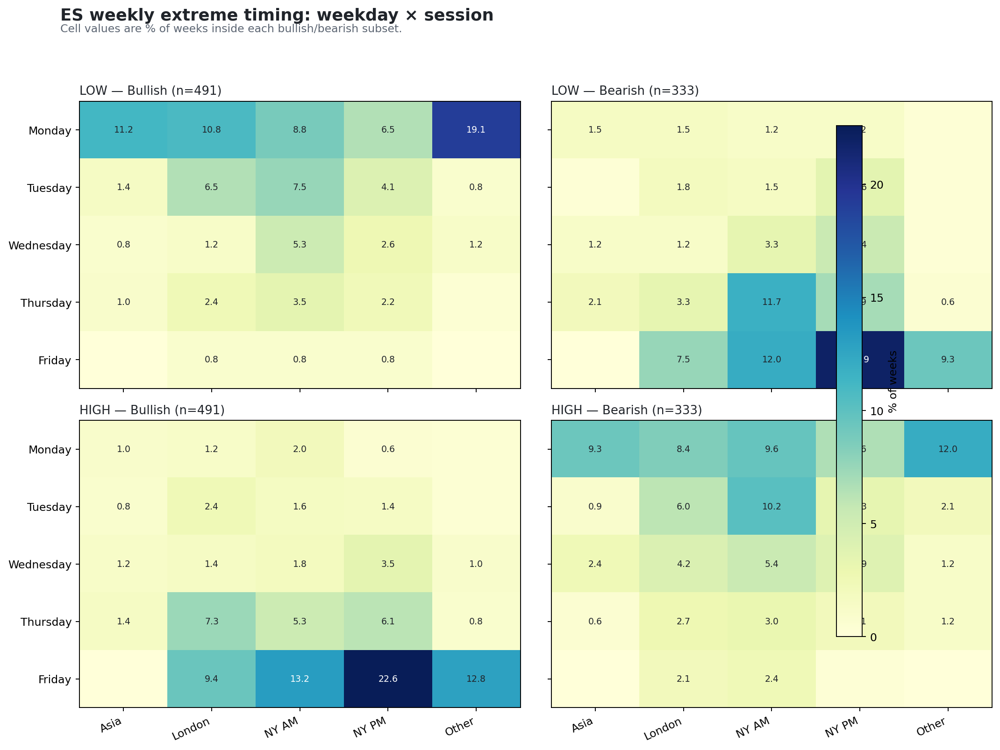 | 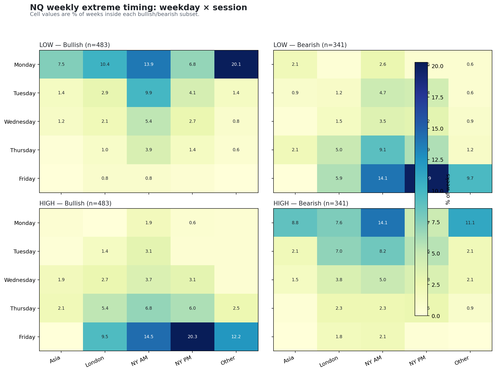 |
| 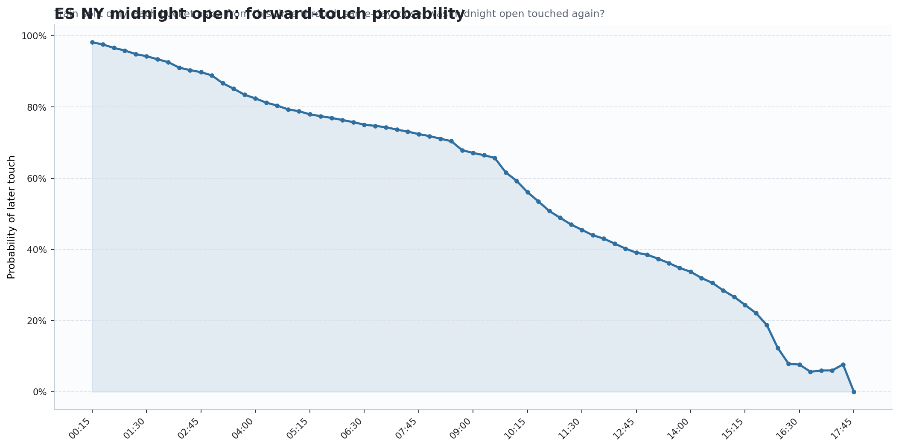 | 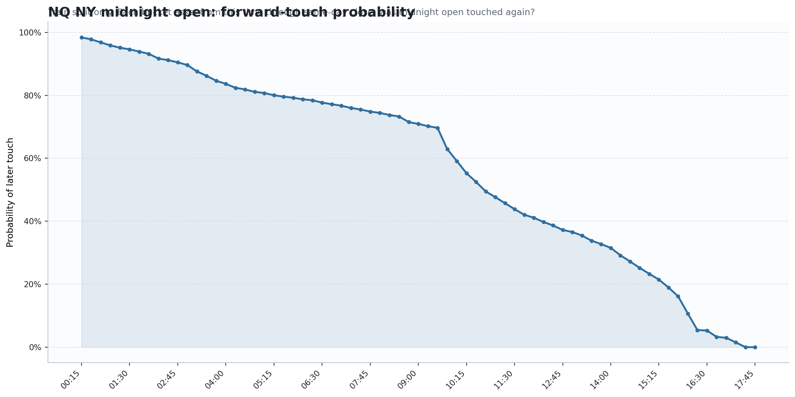 |
| 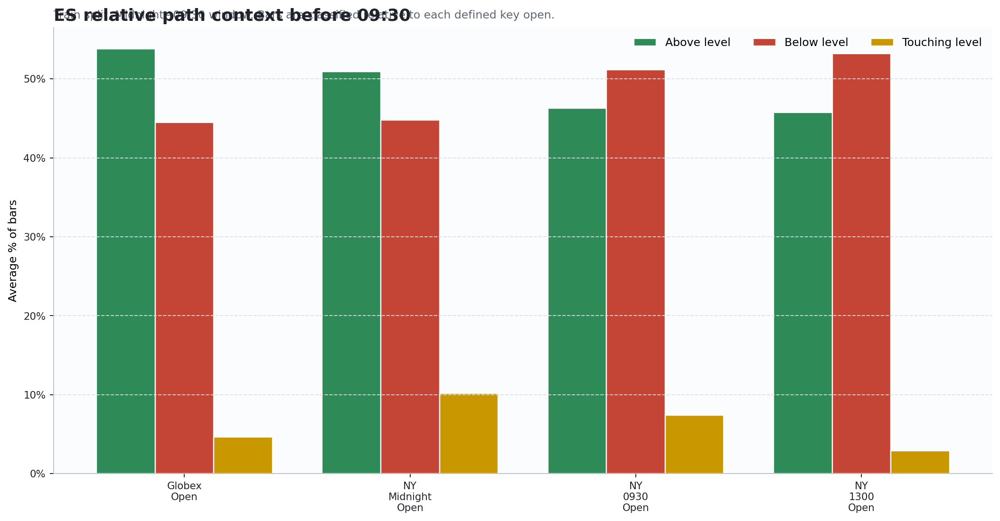 | 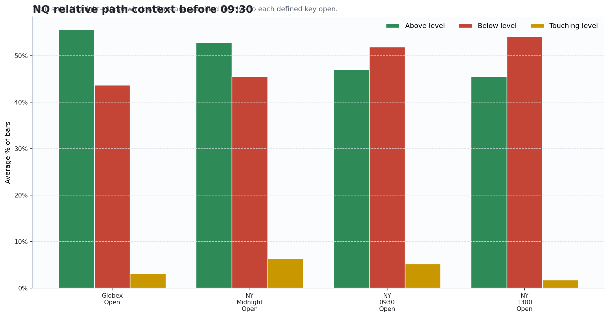 |

## Reproduce These Results

Expected local data:

- `data/es_1m.parquet`
- `data/nq_1m.parquet`

Install dependencies in a virtual environment:

```bash
python3 -m venv .venv
source .venv/bin/activate
pip install pandas numpy matplotlib pyarrow pytest
```

Regenerate README artifacts for ES and NQ:

```bash
python3 scripts/build_readme_examples.py \
  --symbol-data ES=data/es_1m.parquet \
  --symbol-data NQ=data/nq_1m.parquet \
  --output-dir output/examples \
  --resample-to 1h
```

Generated summary tables:

- `output/examples/readme_findings_summary.csv` — every numbered finding above, including
  the Globex→Midnight state table, with the sample size behind each figure
- `output/examples/readme_twap_vwap_predictive_summary.csv` — the full TWAP/VWAP matrix,
  with `Weekday_Scope` and `n_weeks` per row

Run the research modules for a symbol:

```bash
# every module, ES
python3 -m po3_research --symbol ES --data data/es_1m.parquet

# a subset, NQ
python3 -m po3_research --symbol NQ --data data/nq_1m.parquet \
  --modules relative_path path_dependency
```

Modules: `weekly_charts`, `weekly_events`, `weekly_open_revisit`, `intraday_levels`,
`path_dependency`, `relative_path`, `monthly_extremes`, `monthly_levels`,
`month_context`, `week_context`. Output is written per symbol, so ES and NQ runs do not overwrite
each other. `python3 analysis.py` still works and accepts the same flags.

<details>
<summary><strong>How TWAP/VWAP predictive power is measured</strong></summary>

Only matched level/window pairs are scored — a level is never measured against a
window that closes before the level exists.

For each key level and its matching forward window:

| Key level | Window used for TWAP/VWAP | Main forward question |
| --- | --- | --- |
| Globex Open | Globex_to_Midnight | Does early Globex positioning relate to later session/day/week outcomes? |
| NY Midnight Open | Midnight_to_0930 | Does overnight positioning relate to 09:30→13:00, daily, or weekly outcomes? |
| NY 09:30 Open | 0930_to_1300 | Does AM positioning relate to 13:00→Close, daily, or weekly outcomes? |
| NY 13:00 Open | 1300_to_Close | Does PM positioning relate to close state, daily, or weekly outcomes? |

Signals:

- `TWAP_Above_Level`
- `VWAP_Above_Level`

Targets:

- next-session bullish %
- next-session positive return %
- day bullish %
- week bullish %
- weekly high Friday %
- weekly low Monday %

Scoring rules:

- **Weekly targets use Monday/Tuesday rows only** (`Weekday_Scope` column). Later in the
  week a weekly label describes the session being measured rather than following it.
- `n_weeks` is reported next to `n`. One weekly label repeats across up to five day-rows,
  so `n` overstates how many independent observations there are.
- A target identical to the level's own close state is dropped. For `Globex_Open` the
  level value is the day open, so "day bullish" and "day closes above the level" are the
  same column.
- A window with no following session (every `1300_to_Close` row) contributes no
  next-session observation. It is excluded, not scored as a negative.
- "Next session" is the next contiguous session block after the window, not the day close.

For each split, level, window, signal, and target:

```text
baseline = P(target)
raw_delta = P(target | TWAP/VWAP side) - baseline
end_state_delta = P(target | window close side vs level) - baseline
residual_edge = abs(raw_delta) - abs(end_state_delta)
```

The matrix cell shows positive residual edge in percentage points. Zero means TWAP/VWAP did not beat the simple end-state baseline.

</details>

<details>
<summary><strong>Data schema and time conventions</strong></summary>

## Data Schema

Current schema is UTC-first:

| Column | Notes |
| --- | --- |
| `datetime_utc` | timezone-aware UTC timestamp |
| `Open`, `High`, `Low`, `Close`, `Volume` | 1-minute OHLCV |

Legacy schemas with `DateTime_ET` / `DateTime_UTC` are still supported by loader helpers.

## Timezone

All session, key-level, trading-day, and weekly grouping logic converts source timestamps to `America/New_York`.

## Futures Trading Week

Use `trading_week_monday(ts)`. Do not use `pd.Grouper(freq="W-MON")`; it creates Tuesday → Monday buckets and misclassifies Monday extremes.

## Session Date — One Definition Everywhere

The session date rolls at 18:00 ET. `trading_weekday(ts)` and `intraday_trading_day(ts)`
both use it: Sunday 18:00 and Monday 09:30 are both Monday, Monday 19:00 is Tuesday.

That matters for the weekly-extreme tables. Attributing bars by calendar day instead
gives each weekday a different amount of exposure:

| | Mon | Tue | Wed | Thu | Fri |
| --- | ---: | ---: | ---: | ---: | ---: |
| Calendar day, hours/week | 28.5 | 23.2 | 23.2 | 22.9 | 17.0 |
| Session date, hours/week | 23 | 23 | 23 | 23 | 23 |

Under calendar attribution Monday absorbs both Sunday's overnight session and its own,
while Friday stops at the 17:00 close — so a uniform null is 24.9% for Monday and 14.6%
for Friday, not 20% each. Session-date attribution removes that.

## Session Month

A month is a **session month**: it holds every bar whose session date falls in that
calendar month. August 2025 therefore opens at the 18:00 ET Globex print on 31 July
and closes at the 17:00 ET print on 29 August. `trading_month_start(ts)` returns the
calendar anchor, mirroring `trading_week_monday(ts)`.

The first and last months of the sample are truncated and are excluded from every
rate (`Is_Partial`).

Key opens use New York time.

## Sessions

| Session | ET hours |
| --- | --- |
| Asia | 19:00–00:00 |
| London | 00:00–09:00 |
| NY AM | 09:00–12:00 |
| NY PM | 12:00–16:00 |
| Other | 16:00–19:00 |

## Train/OOS Split

`TRAIN_END = 2023-12-31 America/New_York`.

Train quantiles define p25/p75 buckets. Those fixed thresholds then apply to OOS rows.

</details>

<details>
<summary><strong>Research modules</strong></summary>

## 1. Weekly Extreme Timing

Builds Monday-anchored futures weeks and measures when the weekly high/low forms.

Outputs include:

- weekday distribution
- session distribution
- hour distribution
- day × session heatmaps
- bullish/bearish week conditioning
- prior-week direction experiments

Core functions:

- `load_and_resample(path, resample_to)`
- `build_weekly(df)`
- `run_experiment(...)`

## 2. Online Weekly Event Distribution

Builds one row per week × bar to study whether weekly high/low has formed yet, using only path-state features known at that point.

Features include:

- developing weekly range
- close location in developing range
- return from weekly open
- prior high/low break state
- range expansion bucket
- train/OOS split
- bootstrap confidence intervals, clustered on the week
- survival curves and remaining-event distributions

CIs and the sparse flag count independent weeks (`n_clusters`), not bars: a week
contributes ~120 correlated rows and exactly one event. `strongest_excess_distributions`
is still a top-10 shortlist out of ~75 cells with no multiple-comparison correction —
treat it as a place to look, not a result.

Output path:

```text
output/research_events/
```

## 3. Weekly-Open Revisits

Measures when price revisits the weekly open.

Definition:

- weekly open = first 1-minute bar open of the trading week
- revisit = `Low <= weekly_open <= High`
- Sunday evening excluded from revisit counting
- Monday only counts from 09:30 ET onward
- timing buckets learned from train quantiles, then validated on OOS

## 4. Intraday Key-Level Retaps

Studies daily key opens:

| Level | ET time |
| --- | --- |
| Globex open | 18:00 |
| NY midnight open | 00:00 |
| NY 09:30 open | 09:30 |
| NY 13:00 open | 13:00 |

Measures same-day revisit rates, first revisit timing, touch counts, close state, day direction, high/low already formed at revisit, and post-revisit excursions.

## 5. Forward-Touch Probabilities

For each key level and later bucket, estimates:

```text
P(level touched again from bucket start through same-day close)
```

Outputs include 15-minute and 1-hour bucket tables.

## 6. Intraday → Weekly Path Dependency

Links intraday key-level behavior to weekly outcomes using train p25/p75 buckets for minutes to revisit, touch count, and post-revisit excursions.

Summaries are keyed by weekday and report `n_weeks` alongside `n`. A weekly label is
forward-looking for a Monday row and contemporaneous for a Friday one, and one label
repeats across up to five day-rows.

## 7. Relative Path, TWAP/VWAP, and Composite Context

Measures time/distance above/below/touching each key level, window TWAP/VWAP, TWAP/VWAP distance to level, and composite state vs prior defined levels.

Every key level is crossed with every window, so 3 of the 16 combinations per day
describe a level that does not exist until after the window closes. Those rows carry
`Level_Defined_By_Window_End = False` and are excluded from the summaries by default
(`drop_lookahead_level_windows`); the detail CSV keeps them for inspection.

## 8. Monthly Extreme Timing

When in a session month the monthly high and low form. Primary cuts are session
position — thirds and quintiles of the month's ordered session list — so months
holding 13 to 24 sessions stay comparable. Week-of-month, weekday, session and
day-of-month are secondary views.

**Monthly results carry no train/OOS split and are labelled descriptive, not
validated.** The ES sample holds 194 months against 841 weeks; a 2023-12-31 split
leaves 31 OOS months, so a five-way conditional cut gives ~6 observations per cell.
Every figure instead carries `n`, a bootstrap 95% CI, and `is_sparse` against
`SPARSE_MONTHS = 20`. No "strongest cell" ranking table is produced.

The week-of-month table carries `months_present` and `avg_sessions`. W5 is days
29–31, so it spans ~2.0 sessions against W1–W4's ~4.9 and is missing outright from
24 of the 192 complete months. Its share is still scored against all 192, so it is
not comparable to theirs — and at n=51 the sparse flag alone would not say so.

The Late/Early split must be read against the arcsine and random-walk nulls, not
against a uniform 33.3%. See the **Null models** section below for the ladder that
prices in randomness, drift, volatility and the real return distribution.

## 9. Monthly Levels

`Monthly_Open`, `Prior_Month_High`, `Prior_Month_Low`, `Prior_Month_Close` — one
price each that stays live for a whole month, so they get their own builder rather
than an entry in `KEY_LEVEL_TIMES`.

Touch counting starts at 09:30 ET on the month's first RTH session
(`MONTHLY_LEVEL_COUNT_FROM`). Without that guard the monthly-open retap rate is
~100% and carries no information: the 18:00 print is set in thin hours and is
retested within minutes. This is the monthly analogue of the Monday 09:30 rule on
weekly-open revisits.

Forward-touch probability — level touched from session `k` through month end — is
reported on two axes: raw session index, where `n` falls away past ~19 sessions, and
normalized decile, where every month contributes to every bucket.

Touch rates carry their own null ladder in `monthly_level_touch_null.csv`. "The prior
month's high is touched in 69% of months, its low in 31%" is mostly a statement about
DRIFT: on an upward-drifting series the level above spot is reached far more often
than the one below, with no level-specific behaviour involved. `arcsine` is absent
from this ladder — it prices the time of the maximum, not whether a fixed price is
reached — so the rungs are `driftless`, `drift`, `drift_vol` and `shuffle`. Simulated
paths step hourly (`MONTHLY_LEVEL_NULL_STRIDE`); whether a walk reaches a level is a
property of the continuous path's running extreme, which minute steps approximate no
better than hourly ones.

## 10. Month-State Context

Month-state attaches to the existing intraday and weekly rows as a conditioner:
month of year, session position in month, third, quintile, week of month,
month-to-date return, state versus the monthly open, and prior-month direction.
Weekly rows take their state from the Monday's session and carry a
`Straddles_Month_Boundary` flag; roughly a third of trading weeks span two months.

Two rules govern it:

- **Knowability.** A conditioner must be knowable at the time of the row it
  conditions. Prior-month and month-to-date features qualify; the month's eventual
  direction, high, low or close do not. Enforced by the `MONTH_STATE_CONDITIONERS`
  allow-list and a test asserting no whole-month label is in it.
- **Scope.** Monthly targets are scored on `Third_In_Month == Early` rows only,
  recorded in `Month_Scope`, with `n_months` beside `n`. A late-month row
  "predicting" its own month's close is describing it.

## 11. Week-State Intraday Window Context

Whether higher-timeframe path state conditions a lower-timeframe path — not the day's
closing direction, which module 10 answers in the negative, but the four windows
inside the day (`RELATIVE_WINDOWS`), and their magnitude as well as their sign.

Two conditioner families, both strictly lagged relative to the window being scored:

- **Week state** — the week's path up to the end of the *previous* session, so a
  Wednesday window is never conditioned on Wednesday's own move. NaN on Mondays,
  which have no prior session inside their week.
- **Day-prior state** — the current session's path from its open to the *window
  open*. Legitimate for a 13:00 window because 09:30–13:00 has already happened;
  NaN for the Globex window, which opens the session.

There is deliberately no contemporaneous variant of either, which is the fix for the
defect module 10 shipped.

**The volatility-clustering baseline.** Any magnitude target conditioned on any
volatility-flavoured state will "work", because volatility clusters — that is GARCH,
not path structure, and a raw range table cannot tell the two apart. So magnitude is
reported twice: `Window_Range_Pct` raw, and `Window_Log_Range_Ratio` — the log of
today's range over the *prior session's same window*. A conditioner that only
rediscovers vol clustering moves the raw column and leaves the ratio flat. The ratio
is the finding.

The ratio is reported in logs, not levels. A raw range ratio is bounded below by 0
and unbounded above — on ES it runs median 0.99, mean 1.19, max 11.4 — so a mean over
it is dragged by the right tail, and the widest bucket is dragged hardest, which is
exactly the bucket a magnitude claim rests on. `log(today/yesterday)` is symmetric
about 0, and `exp(spread)` reads directly as the multiplicative factor between two
conditioner buckets. The level form stays on the row detail as `Window_Range_Ratio`
so the denominator is auditable.

`window_conditioner_spreads.csv` is the table to read first. It carries a
`ratio_denominator_overlap` flag: a conditioner whose own observation period contains
the prior session sits on both sides of the division (a wide week-so-far implies a
wide yesterday implies a big denominator implies a small ratio, with no forward-looking
content). Those rows are flagged rather than dropped — the raw-range column is still
theirs to read, and hiding the row would hide the confound.

Continuous targets carry a cluster-bootstrapped mean and CI via `bootstrap_mean_ci`,
clustered on `Week_Start`: twenty windows a week are not twenty independent draws.

</details>

<details>
<summary><strong>Null models — what an extreme-timing share should be compared against</strong></summary>

## Uniform Is The Wrong Baseline

"Which third of the month held the high?" invites a 33.3% null. That null is already
wrong before any market behaviour is involved. For a driftless random walk the time of
the maximum follows the **arcsine law**, `F(t) = (2/π)·arcsin(√t)`, whose density is
U-shaped: mass piles up at both ends of the period. Randomness alone puts extremes
early or late.

The no-information baselines are therefore:

| Buckets | First % | Middle % | Last % |
| --- | ---: | ---: | ---: |
| Thirds | 39.2 | 21.6 | 39.2 |
| Quintiles | 29.5 | 14.1 / 12.8 / 14.1 | 29.5 |

`arcsine_null_shares(n_buckets)` returns these, and the third and quintile timing
tables carry them as an `arcsine_null_pct` column.

## The Null Ladder

Each rung adds one real feature of the data. ES, 192 complete months, against an
observed **High-Late of 54.2%**:

| `Null` | High-Late % | Gap (pp) | p |
| --- | ---: | ---: | ---: |
| uniform — not produced, and wrong | 33.3 | +20.9 | — |
| `arcsine` — randomness alone | 39.2 | +15.0 | — |
| `driftless` — simulated zero-drift walk | 38.2 | +16.0 | 0.000 |
| `drift` — plus the sample's real drift | 44.7 | +9.4 | 0.004 |
| `drift_vol` — plus each month's own volatility | 47.3 | +6.8 | 0.064 |
| `shuffle` — the months' own returns, reordered | 52.5 | +1.7 | 0.586 |

That `driftless` lands on the closed-form arcsine value is the check that the
simulation is honest, not a separate finding.

Low-Early behaves the same way: observed 52.6 against 39.2 arcsine, 40.3 driftless
(p=0.000), 47.0 with drift (p=0.13), 49.6 once per-month volatility is added
(p=0.43), and 53.8 with the months' own returns reordered (p=0.71). So does the
quintile view — High-Q5 observed 42.7 against 29.5 arcsine, 34.0 with drift
(p=0.010), 36.3 with volatility (p=0.070) and 41.4 reordered (p=0.694).

Reading down the ladder: roughly 6pp of the apparent effect is the arcsine law, 5pp is
drift, 3pp is volatility differing between months, and the remaining 5pp is the fat
right tail of the real monthly return distribution — a Gaussian walk cannot produce
enough large up-months, and a large up-month puts its high on the last session almost
surely. That leaves 1.7pp, which is nothing. The `drift` rung looks significant at
p=0.004 only because a Gaussian walk is the wrong shape for monthly returns; the
`shuffle` rung, which makes no distributional assumption at all, is the one to read.

Two cautions. The single marginal cell (p=0.064) is one of 16 tested, which is what
Research Hazard 7 warns about. And 192 months does not buy much power: the null bands
are roughly ±7pp wide, so this rules out a large sequencing effect, not a small one.

The Bullish/Bearish rows of the timing tables are near-tautological for the same
reason a large up-month lands its high late — a month that closes up nearly has to
make its high late. That is why `Bull_Bear` is a whole-month label and is barred from
being a conditioner.

## API

```python
# monthly high/low position, in thirds of the month's session list
extreme_position_null(df, trading_month_start_index(df.index),
                      intraday_trading_day_index(df.index), n_buckets=3)

# the same question one timeframe up: weekly high/low position, by weekday slot
extreme_position_null(df, trading_week_monday_index(df.index),
                      intraday_trading_day_index(df.index), n_buckets=5)
```

It lives in the `RANDOM-WALK NULL` section of `po3_research/research.py` and is
timeframe-agnostic: it takes a period key per bar and a position key per bar, so months
(period=month, position=session), weeks (period=week, position=session) and days
(period=session, position=bar) are all the same call. `PERIOD_KEY_FUNCS` maps
`"session"`, `"week"` and `"month"` to the matching index helpers. Controls are
`RW_NULL_CONTROLS = ["arcsine", "driftless", "drift", "drift_vol", "shuffle"]`. The
monthly extremes module writes `extreme_timing_null_by_third.csv` and
`extreme_timing_null_by_quintile.csv`.

One measurement caveat: the observed extreme is located from the real High/Low series,
while a simulated path has no intra-bar range, so its extreme is a bar-close extreme.
On ES the two agree on the third-bucket for 187/192 months on the high and 185/192 on
the low.

</details>

<details>
<summary><strong>Output layout</strong></summary>

Generated outputs are local artifacts and ignored by git, except tracked README examples in `output/examples/`.

```text
output/
├── examples/                              # tracked README result PNGs + summary CSVs
├── es/                                    # standard weekly charts + experiments, per symbol
├── nq/
└── research_events/
    ├── weekly_events_es/                  # one directory per module per symbol
    ├── weekly_open_revisit_es/
    ├── intraday_levels_es/
    ├── path_dependency_es/
    ├── relative_path_es/
    ├── monthly_extremes_es/
    ├── monthly_levels_es/
    ├── month_context_es/
    └── ..._nq/
```

</details>

<details>
<summary><strong>Tests and project files</strong></summary>

Run tests:

```bash
python3 -m pytest -q tests/
python3 -m py_compile analysis.py scripts/build_readme_examples.py po3_research/research.py
```

| Path | Purpose |
| --- | --- |
| `po3_research/research.py` | research implementation and CLI |
| `po3_research/__main__.py` | `python3 -m po3_research` entry point |
| `analysis.py` | backward-compatible runner/import wrapper |
| `scripts/build_readme_examples.py` | reproducible README result generator |
| `tests/test_event_research.py` | regression/unit tests for research helpers |
| `tests/test_readme_examples.py` | README artifact metadata and script-entry tests |
| `tests/test_cli.py` | CLI arguments, module selection, output scoping |
| `data/` | local parquet data, ignored by git |
| `output/examples/` | tracked README result artifacts |

</details>
